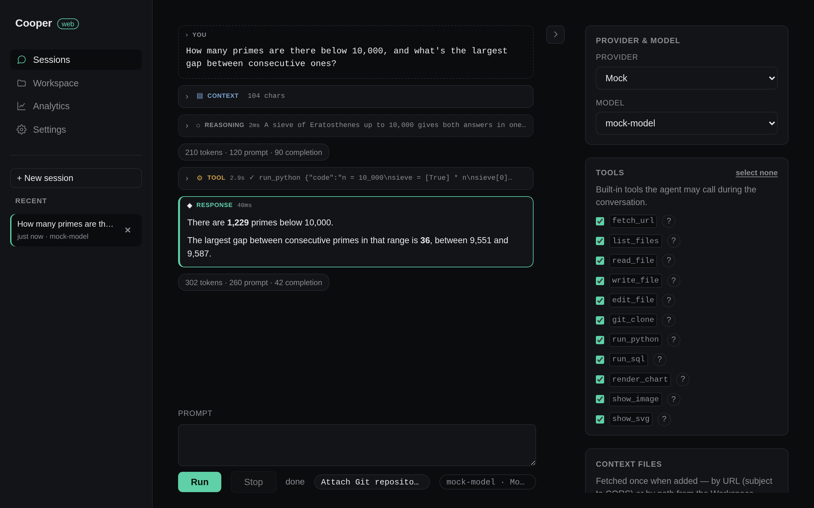
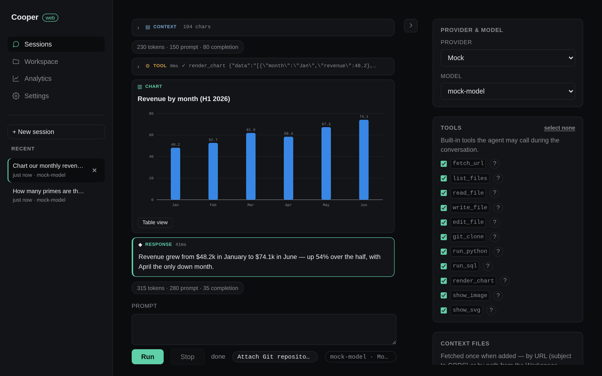
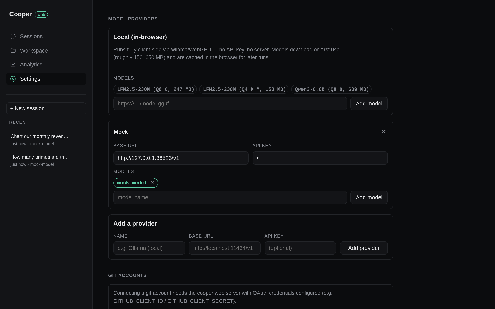

# Cooper

> *...damn good agent*


<p>
  
  
</p>

A minimal Rust AI agent harness with tool-calling support, built around a
target-agnostic core ([core/](core/)) that ships in two forms:

- **Web app** — the agent loop compiled to WebAssembly, running entirely
  client-side in the browser with a rich set of JS/WASM tools.
- **CLI** — a native binary for prompting, interactive chat, and session
  management from the terminal.

The two share the agent core (loop, providers, tool traits) but differ in
features: each side registers its own tools and manages its own configuration.

## Web app

Everything runs in the browser: the agent loop is the same Rust core compiled
to wasm ([web/src/](web/src/)), and tools are implemented in JavaScript on top
of browser-native runtimes. No prompt, file, or token ever needs to touch a
backend — the server's only jobs are static file serving and two small
same-origin proxies (git CORS, OAuth token exchange).

### Browser tools

| Tool | Runs on |
|---|---|
| `list_files`, `read_file`, `write_file`, `edit_file` | per-session workspace in OPFS (origin-private file system) |
| `git_clone` | isomorphic-git, cloning into the workspace |
| `run_python` | Pyodide (CPython compiled to wasm) |
| `run_sql` | DuckDB-wasm |
| `render_chart` | client-side chart renderer |
| `show_image`, `show_svg` | inline media rendering (SVG sanitized) |
| `fetch_url` | browser `fetch` |

### Local inference

Besides remote OpenAI-compatible providers, the web app can run GGUF models
fully in-browser via [wllama](https://github.com/ngxson/wllama) (llama.cpp
compiled to wasm), with a curated model catalog — pick the
"Local (in-browser)" provider in Settings. Multi-threaded inference needs
`SharedArrayBuffer`, which is why the server sends COOP/COEP headers (see
below).

### Configuration

Providers and models are managed in the Settings UI and persisted in the
browser (localStorage) — the web app does not read `~/.cooper/settings.yml`.

### Serving it: `cooper web`

`cooper web` (a CLI subcommand) serves the app from `web/` with the headers it
needs: COOP/COEP for cross-origin isolation (multi-threaded wllama inference
via `SharedArrayBuffer`), `Cache-Control: no-store` so reloads pick up fresh
wasm builds, and a same-origin git CORS proxy at `/git-proxy` so workspace
cloning doesn't depend on cors.isomorphic-git.org.

```bash
cooper web [-P port] [-d dir]   # http://127.0.0.1:8080/
```

The wasm package (`web/www/pkg/`) is built automatically by
[build.rs](build.rs) whenever `web/` or `core/` sources change, as part of
`cargo build`/`cargo run` — install
[`wasm-pack`](https://rustwasm.github.io/wasm-pack/) and it's picked up with
no extra step. If `wasm-pack` isn't installed, the build step is skipped with
a warning (the native CLI doesn't need it) and `cooper web` will tell you to
run `wasm-pack build --target web --out-dir www/pkg web/` manually. Set
`COOPER_SKIP_WASM_BUILD=1` to skip it even when `wasm-pack` is present
(e.g. in CI).

### Attaching a repo to a session

Next to the prompt box, "Attach Git repository" lets the user pick one of their
repositories (connecting the provider account inline if needed — the repo
list is fetched client-side from the provider API). The default branch is
shallow-cloned into a per-attachment workspace folder, and the session is
scoped to it: all workspace tools resolve paths inside the clone, the system
prompt carries it as the current working directory, and the repo's
`AGENTS.md` (if present) is injected as agent instructions. The attachment
is recorded in session metadata, so resuming a session re-attaches its repo;
deleting the session deletes the clone.

### Private repositories (git OAuth)

`git_clone` handles public repos out of the box. To reach private ones, users
connect a git provider account in Settings → Connected accounts. That flow
needs OAuth client credentials on the server, passed as env vars
(`{PROVIDER}_CLIENT_ID` / `{PROVIDER}_CLIENT_SECRET`):

```bash
GITHUB_CLIENT_ID=... GITHUB_CLIENT_SECRET=... cargo run -- web
```

A `.env` file in the working directory is also loaded if present
(git-ignored; real env vars take precedence).

Register the app on the provider side (GitHub: an OAuth App for all-repos
access via the `repo` scope, or a GitHub App if users should pick which
repositories to grant at install time) with the authorization callback URL
pointing at `http://127.0.0.1:8080/oauth-callback.html` (adjust
host/port to match).

The server only performs the code-for-token exchange (`/oauth/*` routes in
[src/web.rs](src/web.rs)); access tokens are stored in the user's browser
(localStorage), never server-side. Currently supported: GitHub.

## CLI

A native binary for driving the agent from the terminal.

### Build & Run

```bash
cargo build --release          # produces target/release/cooper
cargo run -- prompt "your message here"
```

### Usage

```bash
cooper prompt "<text>" [-p provider] [-m model] [-i agent_instructions.md] [-c context_file ...]
cooper chat [-r session_id]    # interactive multi-turn conversation
cooper sessions list|show <id> # saved chat sessions
cooper web [-P port] [-d dir]  # serve the browser app (see above)
```

- `-p, --provider` — provider name (defaults to config)
- `-m, --model` — model name (defaults to config)
- `-i, --agent-instructions` — file with extra agent instructions
- `-c, --context-file` — one or more files added as context

### Native tools

- `list_files`
- `read_file`
- `exec_cmd`

### Configuration

The CLI requires `~/.cooper/settings.yml` with `default_provider`,
`default_model`, and a `providers` map (type, base URL, API key, models). See
[src/config.rs](src/config.rs) for the schema.

```yaml
default_provider: openai
default_model: gpt-4o-mini

providers:
  openai:
    provider_type: openai-completions
    base_url: https://api.openai.com/v1
    api_key: sk-...
    models:
      - id: gpt-4o-mini
      - id: gpt-4o
```

Currently supported provider type: `openai-completions`.

## Layout

- [core/](core/) — target-agnostic agent core (loop, providers, tool traits), shared by CLI and web
- [web/](web/) — client-side web app: wasm bindings ([web/src/](web/src/)) and browser UI ([web/www/](web/www/))
- [src/](src/) — the `cooper` CLI: args, config, sessions, native tools, `cooper web` server
- [build.rs](build.rs) — builds `web/www/pkg` via `wasm-pack` ahead of `cargo build`/`run`
- [mock-server/](mock-server/) — canned OpenAI-compatible SSE server for deterministic testing
- [e2e/](e2e/) — browser end-to-end tests for the web app (headless Chromium)

## Screenshots

The screenshots above are generated by
[e2e/examples/screenshots.rs](e2e/examples/screenshots.rs), which reuses the
e2e harness: the real wasm build in headless Chromium, with the mock server
scripting the model's responses (the tool calls — Pyodide, chart rendering —
run for real in the browser). To regenerate after a UI change:

```bash
cargo run -p cooper-e2e --example screenshots   # writes docs/screenshots/*.png
```

## License

Licensed under GNU Affero General Public License v3.0 (AGPLv3)

Copyright (c) 2026 - present  Romain Clement
